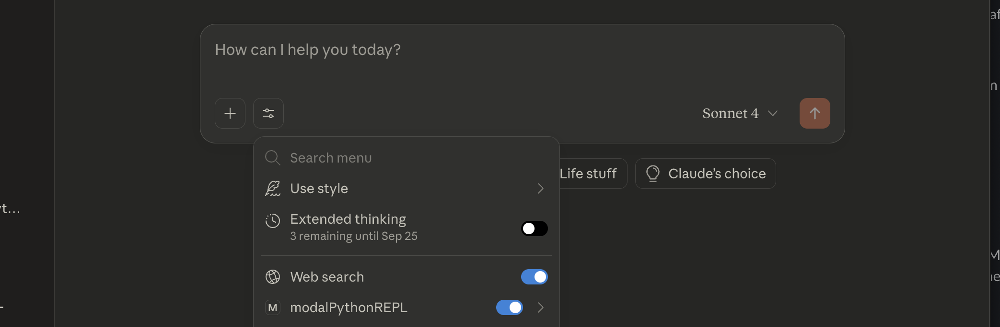
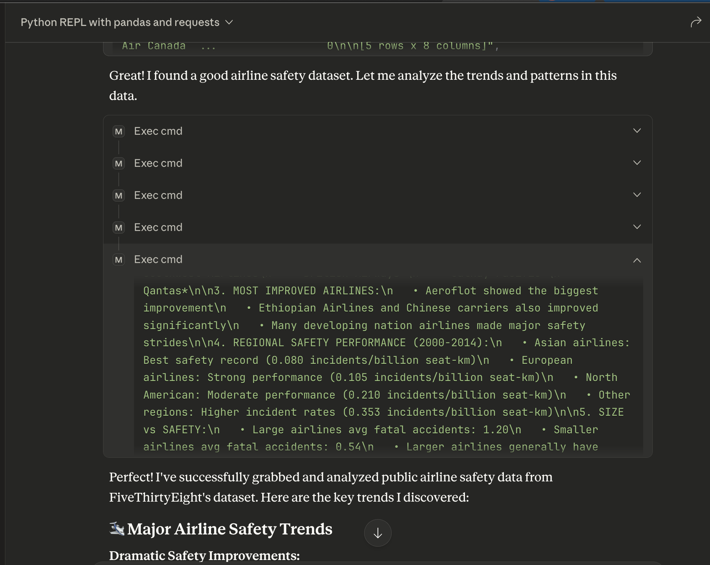
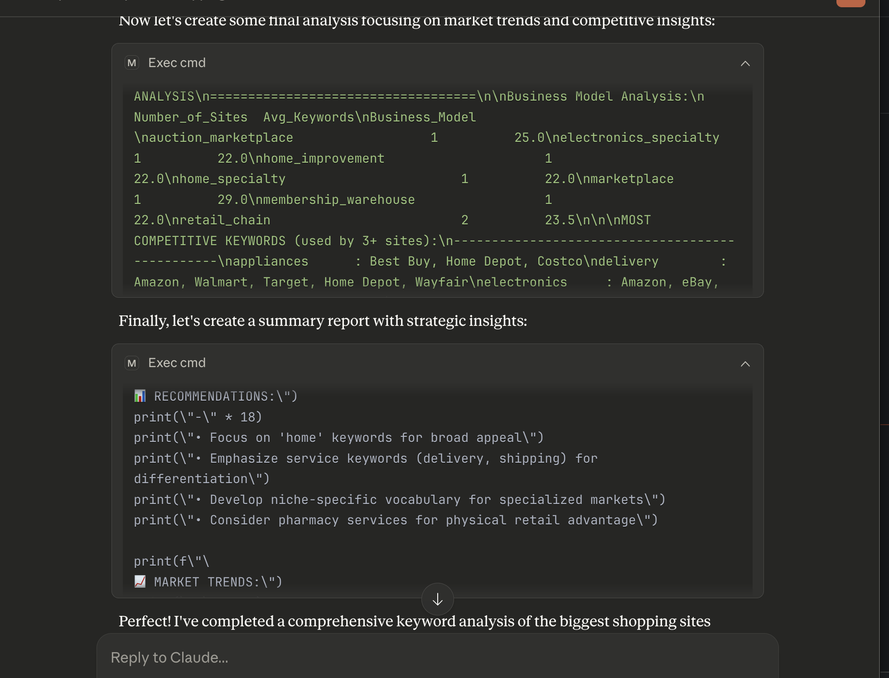

# Modal REPL MCP Integration 


This example shows how to set up a Python REPL built off Modal sandboxes that can be connected to Claude via MCP.


## Setup

In your root directory, run
```bash
git clone https://github.com/modal-labs/modal-examples.git
cd modal-examples/13_sandboxes/repl-mcp
uv sync
touch .env
```

Then, open the `.env` file and paste in the following line: 
```txt
SNAPSHOT_ID_FILE_PATH=~/.modal_repl_snapshot.txt
```

Be sure to setup your Modal account if you haven't yet with `modal setup`.

If you do not have [Claude Desktop](https://claude.ai/download) installed, please install it. 

Create the file `~/Library/Application Support/Claude/claude_desktop_config.json` if it does not yet exist.

Add the following MCP server to the `claude_desktop_config.json` file:


```json
"modalPythonREPL": {
      "command": "uv",
      "args": [
        "--directory",
        "{YourUserRootDirectory}/modal-examples/`13_sandboxes/repl-mcp",
        "run",
        "main.py"
      ]
    }

```

For more information on how to configure this file, see the [MCP Docs](https://modelcontextprotocol.info/docs/quickstart/user/).


## Using the MCP

Open your Claude desktop app and ensure `modalPythonREPL` is toggled on in the "Search and Tools menu:




Claude will have access to 4 tools. These are 

- **`create_repl`**: This creates a new repl with the specified timeout and packages.
- **`exec_cmd`**: Executes a command in the current sandbox. Will return an error if no sandbox has been created or is currently active.
- **`end_repl_and_save_snapshot`**: Shuts down the current Modal REPL and saves a snapshot of it. The ID of the snapshot is saved to the `SNAPSHOT_ID_FILE_PATH` environment variable.
- **`get_repl_from_snapshot`**: Retrives the snapshot ID from the `SNAPSHOT_ID_FILE_PATH` environment variable and restores a repl with the snapshotted memory intact.


Go ahead and try prompting Claude with the activated tool! You can check your Modal account dashboard to track when the REPL's backend sandboxes are active or terminated.

Here's an example snippet of a response on an analysis of airline safety performance on a public dataset:

.


In the Modal Repl, Claude was able to execute a series of complex steps leveraging both the `pandas` and `requests` libraries to analyze airline incident rates.

Here's another snippet of the calls to the Modal REPL Claude used to analyze keyword trends in major shopping sites:




