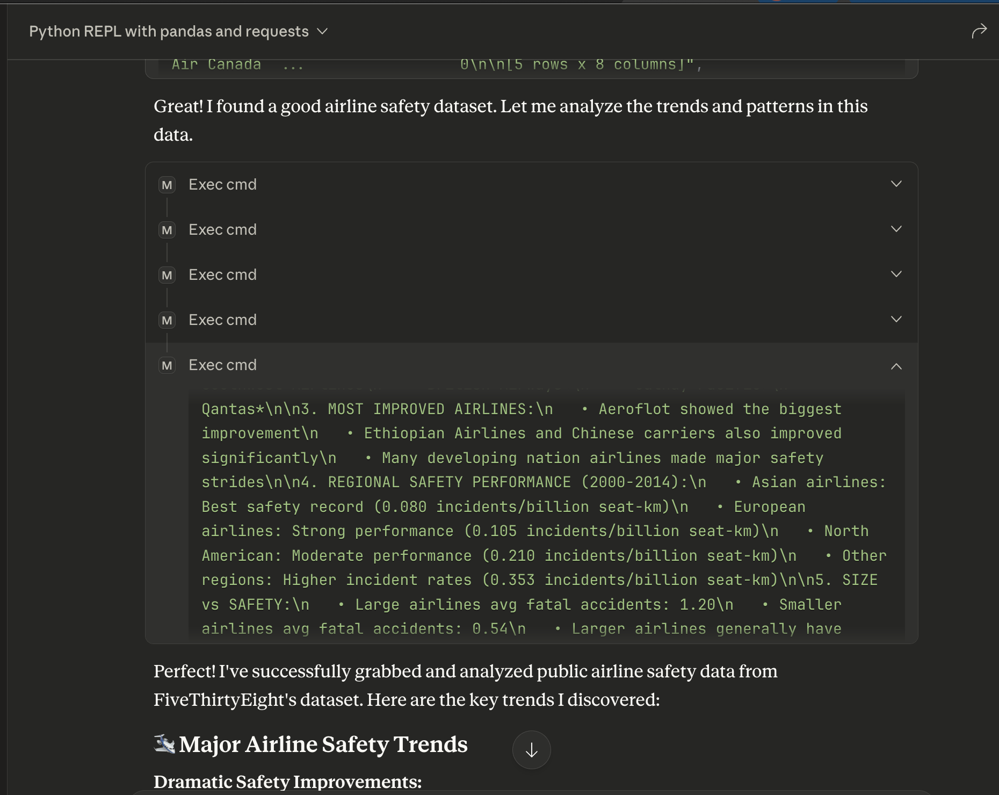
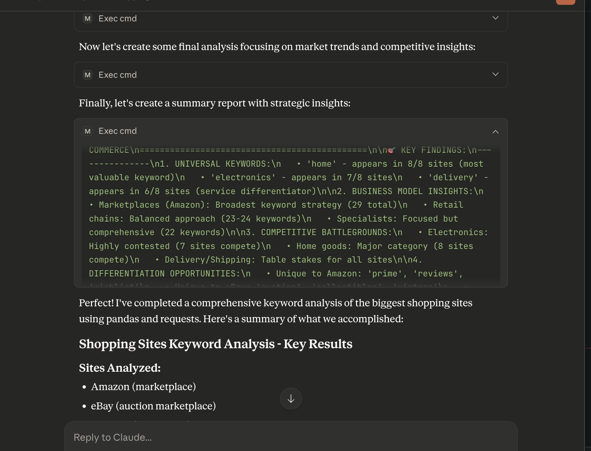

# Modal REPL MCP Integration - HTTP Server


This example shows how to deploy an HTTP server that multiple Modal REPL MCP clients can connect to, with additional auto-stop/snapshot functionality of the backend sandboxes.

## Setup

In your root directory, run
```bash
git clone https://github.com/modal-labs/modal-examples.git
cd modal-examples/misc/repl-http-mcp
uv sync
touch .env
touch ~/.modal_repl_id.txt
```

Then, open the `.env` file and paste in the following line: 
```txt
REPL_ID_FILE=~/.modal_repl_id.txt
```


Be sure to setup your Modal account if you haven't yet with `modal setup`.

If you do not have [Claude Desktop](https://claude.ai/download) installed, please install it. 

Create the file `~/Library/Application Support/Claude/claude_desktop_config.json` if it does not yet exist.

Add the following MCP server to the `claude_desktop_config.json` file:


```json
...
"modalPythonREPLOverHTTP": {
      "command": "uv",
      "args": [
        "--directory",
        "{YourUserRootDirectory}/modal-examples/misc/repl-http-mcp",
        "run",
        "main.py"
      ]
    }
...

```

For more information on how to configure this file, see the [MCP Docs](https://modelcontextprotocol.info/docs/quickstart/user/).


## Deploying the HTTP Server
In the directory of the cloned repository, run `modal deploy http_server.py`. Then, go to your Modal web dashboard and copy the URL of your newly deployed app. Then, in your `.env` file, paste the following line:

```txt
HTTP_SERVER_URL={YOUR_APP_URL}
```

This ensures the MCP server knows where to send requests.


## Using the MCP

Open your Claude desktop app and ensure `modalPythonREPLOverHTTP` is toggled on in the "Search and Tools menu.

Claude will have access to just a single tool, `exec_cmd`. The HTTP server handles all idle timeout and snapshot restore functionality for you, and it also spins up a new REPL for you upon opening Claude Desktop if you have not done so yet. Your REPL id is stored in `~/.modal_repl_id.txt`, which is also the `REPL_ID_FILE` environment variable. Note that if you redeploy the HTTP server you will need to clear this file before using it again.


Go ahead and try prompting Claude, which now has access to the Modal REPL! You can check your Modal account dashboard to track when the REPL's backend sandboxes are active or terminated.

Here's an example snippet of a response on an analysis of airline safety performance on a public dataset:

.


In the Modal Repl, Claude was able to execute a series of complex steps leveraging both the `pandas` and `requests` libraries to analyze airline incident rates.


Here is another example of a response of Claude using the REPL environment with `pandas` and `requests` to do a keyword analysis on shopping sites.

.


Note that our HTTP server is built to handle multiple MCP clients, so you can use the same app URL across multiple devices after you deploy it just once. For all of your clients, the server will support an automated idle timeout/snapshot policy so that your sandboxes aren't running if you aren't actively using as the backend of a REPL via Claude desktop.