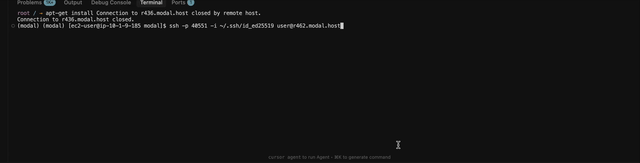

# Serverless SSH Proxy

Instance management wastes people quite a lot of [money](https://x.com/rspruijt/status/1878162991792685252). This project provides a proof of concept of a serverless proxy server that compatible with OpenSSH clients that automatically manages Modal container lifecycles with your connections. A container is automatically booted up upon connection establishment, and a filesystem snapshot is retrieved upon closure and used as a base image for future connections. Besides serving the proxy itself, you never pay for container management.

## Environment Variables

To deploy this script, a few environment variables need to be set.
- `MODAL_TOKEN_ID`: This should be equal to your `token_id` in `~/.modal.toml` assuming you have a (Modal account)[https://modal.com/docs/guide].
- `MODAL_TOKEN_SECRET`: This should be equal to `token_secret` in `~/.modal.toml`.
- `SSH_PUBLIC_KEY`: You can generate a SSH keypair with `ssh-keygen -t ed25519 -C "example@email.com"`. Then run `export SSH_PUBLIC_KEY="$(<~/.ssh/id_ed25519.pub)"`.

Optionally you can also set `MODAL_ENVIRONMENT_NAME` to your desired environment. This will default to `main` if not set.


## Deploy and run

```sh
modal run deploy_script.py
```

As SSH operates above TCP instead of TLS, and instead implements its own security layer, we set an `unencrypted=true` flag when we create a tunnel to our container in our deploy script. Y

## SSH into a container

A command to start an SSH connection will be outputted in your app logs. Assuming you have your SSH private key in `~/.ssh/id_ed25519`, it'll look something like: 

```sh
ssh -p 35109 -i ~/.ssh/id_ed25519 user@r445.modal.host
```

Note that in this implementation of the proxy server the `user` field is a wildcard that can be set to any string and is not used by the proxy server.


## Demo
 Apologies for low resolution! You can view a higher resolution version [here!](./demo.mp4)


## Contributing

Pull requests and issues are welcome!


## License

MIT